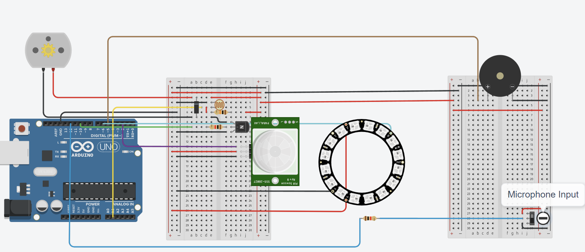

# **Baby-Soother-Project**
This repository contains the design and implementation of an interactive, sensor-based Arduino-powered device that soothes babies with lights, music, and rotating stars, creating a comforting and engaging environment for infants.

---

## Features
- **PIR Sensor Integration:** Activates the system only when a baby is detected to conserve battery life.
- **Light Sensitivity:** Assesses room brightness to activate lights in darkness.
- **Baby State Detection:** Plays music and rotates stars if the baby is crying.
- **Efficient Operation:** Simultaneously runs the motor, piezo, and neopixels through time-sliced programming.
---
## Hardware Requirements
- Arduino board
- PIR sensor
- Neopixel ring (16 LEDs)
- DC motor
- Piezo buzzer
- Power supply
---
## Setup
1. **Circuit Design:**
   - Refer to the [Tinkercad layout](https://www.tinkercad.com/things/9eKrH4nxekQ-copy-of-baby-mobile-with-16-neo/editel?returnTo=https%3A%2F%2Fwww.tinkercad.com%2Fdashboard) for wiring and pin assignments.
   - Ensure all components are correctly connected as per the provided layout.
2. **Upload Code:**
   - Open the Code.ino file in the Arduino IDE.
   - Select the correct board and port in the IDE.
   - Upload the code to your Arduino board.
---
## How It Works
1. The PIR sensor detects the presence of a baby.
2. The system checks room brightness. If dark, the Neopixel ring lights up.
3. If the baby is detected crying, the piezo buzzer plays soothing music, and the DC motor rotates the stars.
---
## Extras
- **Project Report:** A detailed PDF report summarizing the design and implementation is included in the repository.
- Tinkercad Layout: For easy replication of the circuit design.
  

---
## Acknowledgments
This project was completed as part of the **EE1000: Creative Engineering Team Project 1 at Royal Holloway, University of London.**
